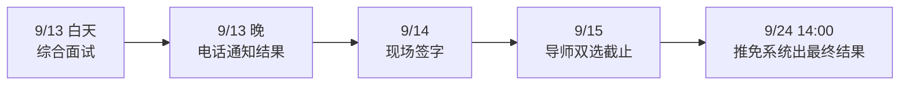

# 北航华为关键软件方向卓工直博保研经验分享

今年 9 月，我参加了北航华为关键软件方向的卓工直博选拔，对应 2027 年入学。

整个流程走下来，最大的感受就是一个字：快。9 月 6 日宣讲，13 日面完，当晚就出结果，15 日导师双选截止。前后加起来也就一周多，中间几乎没有留给人慢慢琢磨的时间。

所以如果你只打算看一句话，那就是这句：**想报这个方向的话，尽量早点联系导师，先把名额和方向聊清楚。** 后面的内容，都是围绕这件事展开的一些细节。

## 个人bg

| 项目 | 情况 |
| --- | --- |
| 综测排名 | 29/158 |
| 科研 | 一篇 CCF-A 论文已录用 |
| 竞赛与荣誉 | 首挑专项赛道一等奖、中国研究生操作系统大赛一等奖、省级优秀大创、冯如杯红旅赛道银奖等 |
| 实习 | 字节跳动端智能部门、华为鸿蒙内存治理部门 |

## 时间线

| 时间 | 事项 |
| --- | --- |
| 9 月 6 日 | 工程硕博士招生宣讲 |
| 9 月 8—10 日 | 系统报名，申请华为关键软件方向直博 |
| 9 月 12 日 | 英语与思政面试 |
| 9 月 13 日 | 综合面试 |
| 9 月 13 日晚 | 电话通知面试结果 |
| 9 月 14 日 | 到现场办理拟录取签字 |
| 9 月 15 日 | 导师双选截止 |
| 9 月 24 日 14:00 | 与全国推免系统同步出最终结果 |

白天面试，晚上接电话，第二天签字，第三天双选截止。要是等到这时候才开始找导师，基本就没什么挑课题、比方向的余地了。

还有一点容易被忽略：卓工报名之前，学院这边的推免成绩认定、综测材料提交和确认也都堆在 8 月底到 9 月初。几件事前后脚挤在一起，很容易顾此失彼。我的建议是暑假就开始盯学院通知，把所有截止时间列到一张表里，也提前准备材料。

## 竞争情况

我报的华为关键软件直博，实际来面试的是 3 个人，最后 3 个人都录了。

每年的面试和录取人数比例的波动非常大，确实很容易出现“选择大于努力”的情况，所以大家还需要慎重考虑。两场面试都只有 15 分钟左右，评委能了解你的时间很有限。整体感觉下来，老师们最看重的还是科研和工程实践上的潜力。

## 面试到底考什么

考核一共两场：英语与思政面试、综合面试。先放个对比表：

| 环节 | 日期 | 时长 | 主要内容 |
| --- | --- | --- | --- |
| 英语与思政面试 | 9 月 12 日 | 约 15 分钟 | 思政随机抽题；英语自我介绍约 8 分钟 + 提问 |
| 综合面试 | 9 月 13 日 | 约 15 分钟 | 自我介绍约 8 分钟 + 围绕简历提问；不能放 PPT，可带打印材料 |

### 第一场：英语与思政

9 月 12 日，总共 15 分钟左右。

思政是随机抽题，我抽到的是谈谈对“红色工程师”的理解。这种题不用想得太复杂，扣住题目，结合自己的专业和卓工的培养目标说就行。

英语部分要先做一个 8 分钟左右的自我介绍。8 分钟其实挺长的，最好提前写好、多练几遍。介绍完以后，老师会结合你的自我介绍、简历和申请方向来提问。我被问了两个问题，大概意思是：

- 为什么选择华为？
- 以后打算继续做哪些方向？

如果自我介绍里已经把经历、动机和方向串起来了，回答的时候顺着往下说就好，不用现场硬编。也可以提前准备一些面试可能问到的问题。

### 第二场：综合面试

9 月 13 日，也是 15 分钟左右，其中 8 分钟是自我介绍。注意，现场不能放 PPT，但可以带打印好的材料。

自我介绍完，老师根据简历问了两个问题，都是关于实习经历的。

这一场里我踩了一个小坑。自我介绍时，我把一段偏底层架构开发的工作说成了 AI Infra 方向，评委当场就对这个说法提出了质疑。

## 聊聊我为什么选卓工直博

我选华为关键软件卓工直博，主要是想在充分参与工程实践的同时，把科研经历继续做扎实，最后拿到博士学位。

据我了解，培养方式是校内两年、企业三年，校企双导师一起带。我提前联系了校内导师，现在已经进组实习了；企业导师那边，到写这篇文章的时候还没有联系上。

说回开头那句建议。从接到结果电话到双选截止只有两天，提前联系导师的好处是很实在的：

- 面试前，你能知道导师有没有名额、有哪些课题，准备起来更有方向；
- 面试后，双选不用临时到处找人；
- 如果能提前进组，还能早点熟悉课题和组里的同学。

## 给学弟学妹的一些建议

最后按时间顺序，把我觉得值得注意的地方再捋一遍。

### 报名前

- 早点联系导师，名额和课题方向越早确定越好。
- 推荐信、需要盖章的现实表现材料，尽早找老师处理，别等报名开放了再到处跑。
- 推免成绩认定、综测、卓工报名、纸质材料提交这几件事挨得很近，每一项的截止时间都要单独核对。具体要什么材料，以当年的招生通知为准。

### 报名和面试期间

- 填报的时候慢一点，学位类别、企业、领域或课题、是否接受调剂，每一项都看清楚再点提交。
- 面试通知一定要逐字看，时间、地点、能不能放 PPT、要带什么，都写在里面。
- 综合面不能放 PPT，可以把简历和自我介绍的要点打印出来，多备几份给评委看。
- 英语面试别只准备自我介绍，“为什么选这家企业”“以后想做什么”这类问题也提前想好，跟自我介绍的说法保持一致。
- 把自己的简历吃透。综合面的问题基本都从简历里来，每段经历都要能讲清楚具体做了什么，技术名词别乱用。

### 出结果之后

- 面试当晚会打电话通知结果，那几天手机别静音。
- 签字之前，确认清楚自己实际被录到了哪个企业、哪个方向。
- 导师双选很快就截止，这时候提前联系过导师的优势就很明显了。
- 最终结果和全国推免系统同步发布，记得按要求在系统里完成确认。

## 写在最后

回头看，这次申请让我体会最深的就是两件事：一是早点和导师沟通，二是把自己做过的事讲准确。前一件决定了后面的流程能不能从从容容地走完，后一件决定了那短短 15 分钟里，老师能不能真正看清你做过什么。

以上就是我这次申请的全部经历，希望对正在考虑北航华为关键软件卓工直博的同学有点帮助。祝大家都能找到适合自己的方向和导师，顺利上岸！
