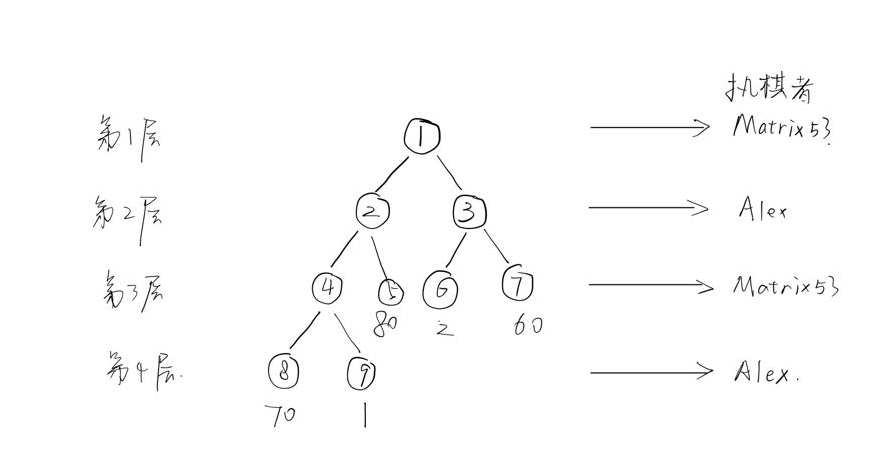
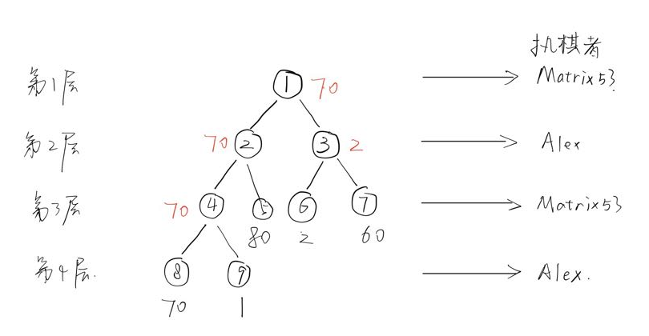

# C1.G 题解

## 问题分析

以下面数据为例，

```
9
1 2 
1 3
3 6 
3 7
2 4 
2 5
4 8
4 9
80 2 60 70 1
```

先画出树的图如下：（规定对于一个结点，若有多个子结点，按子结点输入的顺序从左到右排好）



从图中可以得出，**奇数层**为Matrix53执棋，会选择孩子结点中胜率最大的作为该节点胜率；**偶数层**为Alex执棋，会选择孩子结点中胜率最小的作为该节点胜率。若要得到题目所求，需要自下而上分析并需要对比兄弟结点的胜率，得到每一个父结点的胜率，最终得到根结点的胜率。推导出根节点胜率如下图：



## 解题思路

### **1.存放树关系**：

对于一个结点，记录其子结点个数，记录其最后一个子结点的编号，记录其左边（如图中，先输入父子关系的子结点在左边）一个兄弟结点的编号；

### **2.存叶子结点的值**：

按编号顺序访问所有结点，并记录子结点个数为零的结点为叶节点，这样得到的就是编号按从小到大的排好的叶节点，对应输入后得到叶节点胜率；

### **3.深度优先算法遍历**：

用op代表层数，从根节点开始，往子结点遍历，每往下一层的op值需要+1。

对于某个存在子结点的结点，在深度优先遍历后其子结点的胜率已确定，则访问该结点的最后一个子结点，再访问该子结点的兄弟结点，以此类推，从而依次访问到该结点所有子结点的胜率，记录胜率最大值或者最小值。若op是奇数，则该结点记录的胜率是最大值；若op是偶数，则该结点记录的胜率是最小值。

由于叶节点胜率已知，可以按上述过程从下到上确定所有结点的胜率，最终得到根结点胜率。

## 数据结构

定义结构体存放结点相关信息，建一个结构体类型的数组存放结点信息，其中数组下标即结点编号。

```c
typedef struct node{
	int child_sum;//该节点的子节点数 
	int last_child;//最后一个子节点的编号 
	int bro;//最近的一个兄弟结点的编号 
	int win;//胜率 
}lnode;
lnode data[MAX];//数组下标即编号 
```

用一个int类型的数组存放从小到大排好的叶节点编号。

```c
int leave[MAX];//叶节点从小到大排 
```

## 代码

```c
#include <stdio.h>
#define MAX 1000005
int n;
int leave[MAX];//叶节点从小到大排 
typedef struct node{
	int child_sum;//该节点的子节点数 
	int last_child;//最后一个子节点的编号 
	int bro;//最近的一个兄弟结点的编号 
	int win;//胜率 
}lnode;
lnode data[MAX];//数组下标即编号 

//建立树关系
void add_data(u, v){
	data[v].bro = data[u].last_child;//记录v之后要访问的兄弟结点 
	data[u].last_child = v;//记录u最新的子节点编号
	data[u].child_sum++; 
}

//op表示层数（奇数为Matrix53，偶数为Alex）
void dfs(int op, int f){
	if(data[f].child_sum == 0) return;
	int max_child = 0, min_child = MAX, tofo = data[f].last_child; 
	while(tofo != 0){
		dfs(op + 1, tofo); //往子结点递归
		//如果是Matrix53下棋(单数层)，取最大值
		if(op % 2){
			if(max_child < data[tofo].win)
				max_child = data[tofo].win;
		}
		//如果是Alex下棋（偶数层） ，取最小值
		else{
			if(min_child > data[tofo].win)
				min_child = data[tofo].win; 
		}
		tofo = data[tofo].bro;//依次访问兄弟结点，从而进行比较得到最大值或者最小值
	}
	if(op % 2) data[f].win = max_child;//如果是Matrix53下棋(单数层)
	else data[f].win = min_child;//如果是Alex下棋（偶数层）
}

int main(){
	int i, father, child, k = 0;
	scanf("%d", &n);
	for(i = 1; i < n; i++){
		scanf("%d%d", &father, &child);
		add_data(father, child);//建树
	}
	for(i = 1; i <= n; i++){
		if(data[i].child_sum == 0)
			leave[++k] = i;//得到编号从小到大排好的叶节点
	}
	for(i = 1; i <= k; i++){
		scanf("%d", &data[leave[i]].win);//得到叶节点胜率
	}
	dfs(1, 1);//从第一层开始遍历
	printf("%d\n", data[1].win);
	return 0;
} 
```

## 启示

1.树的存储方法（解决子结点数不确定问题，并且能指向兄弟结点 ）；

2.深度优先算法的巧妙应用。