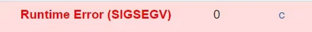

# 算法设计与分析 C1-J 题解

## 题意

本题的题意还是比较清晰：先按一定顺序输入 `n` 个 `int` 型数整数记录为 `data` 数组元素，然后输入若干 `int` 型整数，输出每个数在 `data` 数组中**第一次出现**的位置。

## 解法

### 不太成熟的解法

- 看到此题最直观的解法是使用类似 “桶排序” 的方法，开一个数组 `mark` 存入 `data` 数组中每个元素第一次出现的位置，其中 `mark` 数组的下标对应 `data` 数组中元素的值，存储的数据对应该元素第一次出现的位置。

- 但由于数据范围的的问题，`int` 型整数的范围为`-2147483648~2147483647` ，而开一个这么长的数组将会不可避免的收获

  

  因此需要考虑其他稍复杂的解法。

### 正确的解法之一

- 考虑使用结构体存放每个输入元素的**值**和对应的**输入位置**，将输入的所有数据**按值排序**后使用**二分查找**求解元素第一次出现的位置。

#### 排序过程

- 需要注意，对于元素值相同的结构体，需要再按其输入位置进行次一级排序，以保证二分查找的过程中能够检索到**第一次出现**的位置，即排序算法需要是**稳定的**，在此提供两种解决方案。

- **归并排序**

  ```c
  void merge(NUM num[],NUM tmp[],int left,int mid,int right)
  {
  	int i=left,j=mid+1,k=left;
  	while(i<=mid && j<=right)
  	{
  		if(num[i].val<=num[j].val)
              tmp[k++]=num[i++];
  		else
  			tmp[k++]=num[j++];
  	}
  	
  	while(i<=mid)
          tmp[k++]=num[i++];
  	while(j<=right)
          tmp[k++]=num[j++];
  	for(i=left;i<=right;i++)
          num[i]=tmp[i];
  }
  
  void mSort(NUM num[],NUM tmp[],int left,int right)
  {
  	int mid;
  	if(left<right)
  	{
          mid=(left+right)/2;
  		mSort(num,tmp,left,mid);
  		mSort(num,tmp,mid+1,right);
  		merge(num,tmp,left,mid,right);
  	}
  }
  
  int main()
  {
      ...
      mSort(num,tmp,0,n-1);
      ...
  }
  ```

- **快速排序**

  ```c
  int compar(const void *a,const void *b)
  {
  	NUM A=*(NUM *)a;
  	NUM B=*(NUM *)b;
  	if(A.val==B.val)	//元素值相等时按位置排序
  		return A.pos-B.pos;
  	else				//元素值不等时按元素值排序
  		return A.val-B.val;
  }
  
  int main()
  {
      ...
      qsort(num,n,sizeof(num[0]),compar);
      ...
  }
  ```

#### 查找过程

- 由于需要找到元素第一次出现的位置，因此在查找到对应元素值时不能立刻输出，而要继续进行二分直到找到该值第一次出现的位置。

  ```c
  void find(int x,int n)
  {
  	int low=0,high=n-1;
  	int mid;
  	while(low<high)
  	{
  		mid=(high+low)/2;
  		if(num[mid].val==x)				//值相等时继续二分
  			high=mid; 
  		else if(num[mid].val<x)
  			low=mid+1;
  		else
  			high=mid-1;
  	}
  	if(num[high].val==x && high>=0)		//找到第一次出现的位置
  	{
  		printf("%d\n", num[high].pos);
  		return;
  	}else
  	{
  		printf("NO\n");
  		return;
  	}
  }
  ```

### AC代码

```c
#include<stdio.h>
#include<math.h>
#include<stdlib.h>
#include<string.h>
#include<ctype.h>
#include<time.h>

typedef struct number{
	int val;  //元素的值
	int pos;  //元素的输入位置
}NUM;
NUM num[1000010],tmp[1000010];

//二分查找函数
void find(int x,int n)
{
	int low=0,high=n-1;
	int mid;
	while(low<high)
	{
		mid=(high+low)/2;
		if(num[mid].val==x)				//值相等时继续二分
			high=mid;
		else if(num[mid].val<x)
			low=mid+1;
		else
			high=mid-1;
	}
	if(num[high].val==x && high>=0)		//找到第一次出现的位置
	{
		printf("%d\n", num[high].pos);
		return;
	}else
	{
		printf("NO\n");
		return;
	}
}

//归并排序函数
void merge(NUM num[],NUM tmp[],int left,int mid,int right)
{
	int i=left,j=mid+1,k=left;
	
	while(i<=mid && j<=right)
	{
		if(num[i].val<=num[j].val)
            tmp[k++]=num[i++];
		else
			tmp[k++]=num[j++];
	}
	
	while(i<=mid)
        tmp[k++]=num[i++];
	while(j<=right)
        tmp[k++]=num[j++];
	for(i=left;i<=right;i++)
        num[i]=tmp[i];
}

void mSort(NUM num[],NUM tmp[],int left,int right)
{
	int mid;
	if(left<right)
	{
		mid=(left+right)/2;
		mSort(num,tmp,left,mid);
		mSort(num,tmp,mid+1,right);
		merge(num,tmp,left,mid,right);
	}
}

//快速排序比较函数
int compar(const void *a,const void *b)
{
	NUM A=*(NUM *)a;
	NUM B=*(NUM *)b;
	if(A.val==B.val)	//元素值相等时按位置排序
		return A.pos-B.pos;
	else				//元素值不等时按元素值排序
		return A.val-B.val;
}

int main()
{
	int n,x;
	scanf("%d",&n);
	for(int i=0;i<n;i++)
	{
		scanf("%d", &x);
		num[i].val=x;
		num[i].pos=i+1;
	}
	
    //这里的排序算法可以任选其一
	mSort(num,tmp,0,n-1);					//归并排序
	qsort(num,n,sizeof(num[0]),compar);		//快速排序
	
	while(scanf("%d", &x)!=EOF)
		find(x,n);
	
	return 0;
}
```

